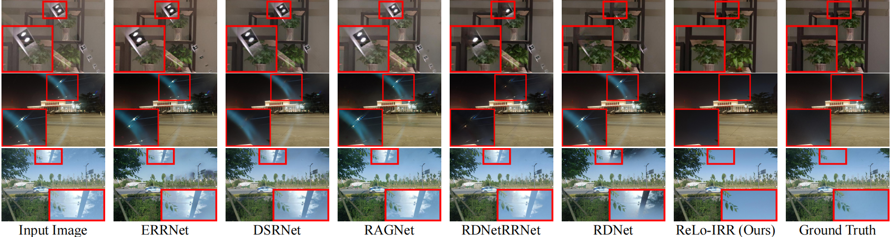
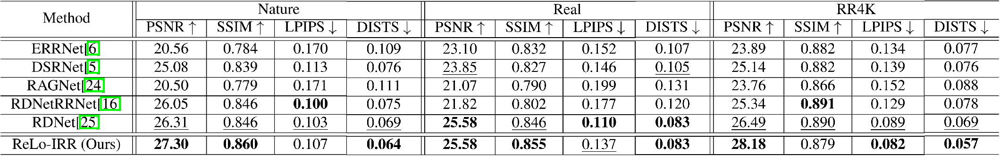
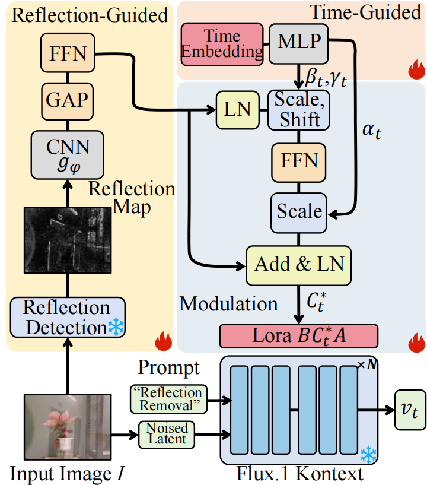

<h1 align="center"> ReLo-IRR:<br>Reflection-Guided Lora Framework for Image Reflection Removal </h1>
<div align="center">
  <a href=''></a>  &nbsp;
  <a href="https://github.com/KONGBAI-8080/ReLo-IRR"></a> &nbsp; 
  <a href='https://cloud.189.cn/t/fMreAnJvIj2a（访问码：2in6）'></a> &nbsp; 
</div>

> Official PyTorch implementation of **ReLo-IRR**, accepted by ICASSP 2026.

## 📢 Updates
- **[2026.07.02]** Full official code release: core model, training pipeline and evaluation scripts are all available.
- **[2026.05.07]** 🎉 ReLo-IRR paper is accepted by **ICASSP 2026**!

## ✨ Features
- ✅ Core model implementation
- ✅ Complete training pipeline
- ✅ Quantitative evaluation & inference scripts

## Overview

**RELO-IRR** is a robust reflection-guided LoRA
framework that explicitly integrates **reflection priors** and **time-conditioned modulation** into rectified flow inference for single-image reflection removal. Unlike prior methods with uniform adaptation, **ReLo-IRR** enables input-aware and stage-aware control over reflection suppression.

<p align="center">
  
</p>
<p align="center">
  
</p>


The RELO-IRR pipeline consists of:
1.  **Reflection-Guided LoRA Modulation** firstly employs a pretrained reflection detector to generate image-dependent reflection map and then extract features by a simple network, secondly leverages reflection priors to generate modulation parameters for LoRA fine-tuning and achieve reflection awareness.
2.  **Time-Conditioned Reflection Guidance** incorporates temporal awareness via timestep embeddings to generate time-dependent parameters for adaptive LoRA modulation, then applys stronger reflection suppression at early steps and conservative refinement in later stages.

<p align="center">
  
</p>


## 🚀 Quick Started
### 1. Environment Setup
Clone the repository and install dependencies:
```bash
git clone https://github.com/KONGBAI-8080/ReLo-IRR.git
cd ReLo-IRR

# Create conda environment
conda create -n sirr python=3.11
conda activate sirr

# Install dependencies
pip install -r requirements.txt
```

### 2. Pretrained Models
Prepare the following pretrained weights before running:
1.  **Base Diffusion Model**: `black-forest-labs/FLUX.1-dev`
2.  **<a href='https://cloud.189.cn/t/fMreAnJvIj2a（访问码：2in6）'>RDNet Weights</a>** (from CVPR 2024 paper *Revisiting Single Image Reflection Removal in the Wild*):
    - `RD.pth`
    - `efficientnet-b3-5fb5a3c3.pth`

### 3. Dataset Preparation
We support 3 standard SIRR (Single Image Reflection Removal) benchmarks:

| Dataset | Total Pairs | Train Split | Test Split | Description |
|:--------|:-----------:|:-----------:|:----------:|:------------|
| <a href='https://cloud.189.cn/t/fMreAnJvIj2a（访问码：2in6）'>Real</a>    | 110         | 90          | 20         | Paired images of natural scenes |
| <a href='https://cloud.189.cn/t/fMreAnJvIj2a（访问码：2in6）'>Nature</a>  | 220         | 200         | 20         | Real-world pairs captured by Canon camera |
| <a href='https://pan.baidu.com/s/1yJ5Sdnd8rFtR1CitsCeL9g?pwd=rr4K'>RR4K</a>    | 1326        | 1230        | 96         | High-resolution 4K image pairs |

### 4. Training
Following the common protocol of SIRR methods:
- Train on **Nature + Real** datasets for general scene reflection removal
- Train separately on **RR4K** for high-resolution scenarios

We also provide pretrained <a href='https://pan.baidu.com/s/1yJ5Sdnd8rFtR1CitsCeL9g?pwd=rr4K'>checkpoints</a> to skip training:
- General scenario: `checkpoint-5200`
- High-resolution (RR4K): `rr4k_checkpoint-5200`

Run the training script:
```bash
chmod +x ./Kontext_lora_sirr.sh
# Configure data paths and hyperparameters in the script before execution
./Kontext_lora_sirr.sh
```

### 5. Inference & Evaluation

#### Quantitative Evaluation
Calculate metrics on test datasets:
```bash
python sirr_metric_eval.py \
    --base_model /path/model/FLUX.1-Kontext-dev \
    --lora_dir /path/SIRRCheckPoints/checkpoint-5200 \
    --s3_model /path/SIRRCheckPoints/checkpoint-5200/S3DiffImageEnergy_model.safetensors \
    --pretrained_ref_det_path /path/model/RDNetRRNetModels/weights/RD.pth \
    --pretrained_ref_det_backbone_path /path/model/EfficientNet/efficientnet-b3-5fb5a3c3.pth \
    --in_path /path/datasets/xxx/blended \
    --gt_path /path/datasets/xxx/transmission_layer \
    --out_dir /path/output \
    --prompt "reflection removal" \
    --save_results \
    --dataset_name xxx \
    --steps 24 \
    --rank 16 \
    --seed 0 \
    --dtype bf16 
```

#### Inference on Custom Images
Run reflection removal on your own image folder:
```bash
python sirr_inf.py \
    --base_model /path/model/FLUX.1-Kontext-dev \
    --lora_dir /path/SIRRCheckPoints/checkpoint-5200 \
    --s3_model /path/SIRRCheckPoints/checkpoint-5200/S3DiffImageEnergy_model.safetensors \
    --pretrained_ref_det_path /path/model/RDNetRRNetModels/weights/RD.pth \
    --pretrained_ref_det_backbone_path /path/model/EfficientNet/efficientnet-b3-5fb5a3c3.pth \
    --input ./examples \
    --out_dir ./output_res \
    --prompt "reflection removal" \
    --steps 24 \
    --rank 16 \
    --seed 0 \
    --dtype bf16
```

## 🤗 Acknowledgement
This repo is based on [diffusers](https://github.com/huggingface/diffusers). We thank the authors for their valuable contributions to the AIGC community.

## ⭐Citation
If you find ReLo-IRR useful for your research or projects, we would greatly appreciate it if you could cite the following paper:
```
@INPROCEEDINGS{wang2026ReLo-IRR,
  title={ReLo-IRR: Reflection-Guided Lora Framework for Image Reflection Removal}, 
  author={Wang, Chaoqun and Wei, Yuehuan and Cao, Haoxiang and Min, Shaobo},
  booktitle={ICASSP}, 
  pages={13317-13321},
  year={2026},
}
```

## 📄 License
This project is released under the [MIT License](LICENSE).